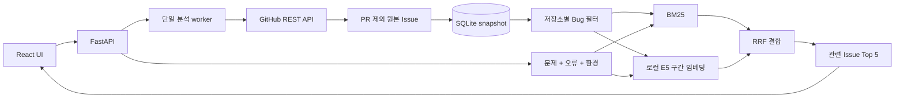

# 구조와 데이터 흐름

분석 작업은 별도 스레드 하나에서 순차 실행합니다. 저장소가 같으면 중복 분석 요청에 기존 작업 ID를 포함한 409를 반환합니다. 여러 저장소의 작업은 대기열에 들어갑니다. 검색은 완성된 스냅샷을 읽기 때문에 새로고침 도중에도 이전 데이터를 사용할 수 있습니다.

SQLite에는 공개 원본 Issue JSON, 수집 메타데이터, 필터와 데이터의 해시로 계산한 스냅샷 버전, 작업 상태를 저장합니다. 데이터 수집 완료 후 트랜잭션으로 반영합니다. 레이블 변경은 원본 캐시에 다시 적용하고 새 스냅샷 버전을 만듭니다.

BM25 인덱스는 메모리에 만들고 재시작 시 SQLite에서 다시 구성합니다. 임베딩은 원문 해시와 확정 모델 commit, 분할 설정별 NumPy 파일로 저장합니다. 모든 문서가 준비된 뒤 manifest를 원자적으로 교체합니다. query/passage 접두사를 구별하고 구간 간 최대 코사인 값을 사용합니다.

모델 추론과 인덱싱은 모델 단위 잠금으로 직렬화합니다. 로컬 MVP의 메모리·동시 실행 안정성을 위한 선택입니다. 문서 수·문서 길이가 커지면 전체 행렬 검색, 최대 구간 비교의 비용이 커질 수 있습니다.

Issue Markdown은 HTML로 해석하지 않고 React 텍스트로 표시합니다. 결과 URL은 검증된 저장소 이름과 Issue 번호로 생성합니다. 토큰은 환경변수에서 서버가 읽으며 API 응답에 포함하지 않습니다. 검색 입력은 DB나 애플리케이션 로그에 별도로 저장하지 않습니다.
