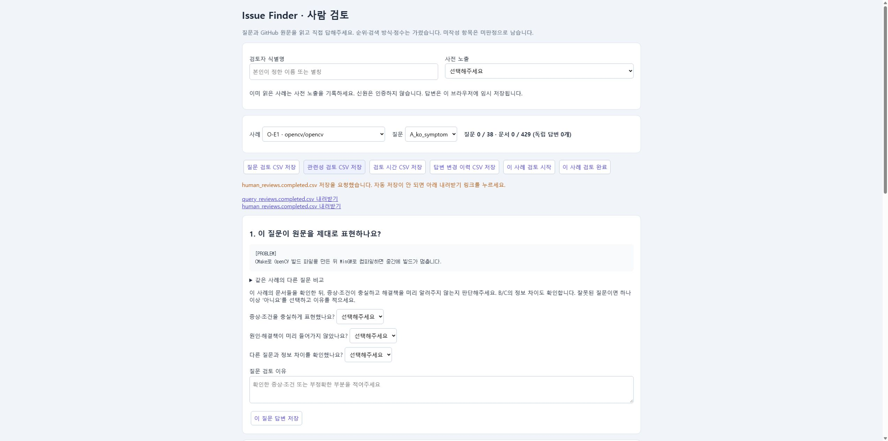
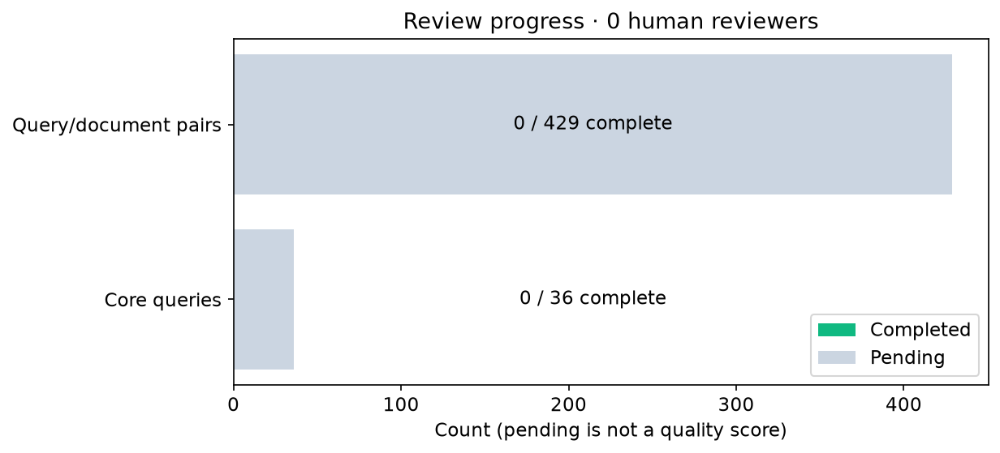

# batch_001 · AWAITING_HUMAN_REVIEW

[선택적 간단 확인: 질문 1개·이슈 최대 3개·이름 입력 없음](quick-review.md)으로 기본 화면을 줄였습니다. 전체 검토는 필수가 아닙니다.

실제 사람 0명 · 검토 0/429쌍 · 비교 0/36질의.

[보고서와 실행·재개 명령](report.md) · [전체 사례집](casebook.md) · [원자료와 그림 생성 조건](figure_data/) · [테스트](tests/)

품질 수치는 사람 판정의 공통 분모가 갖춰질 때만 계산합니다. 부모 run_001은 보존했습니다.
