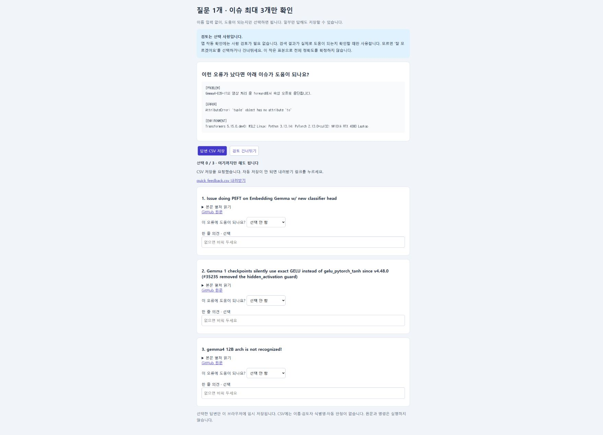

# 선택적 간단 확인으로 축소

질문 38개·문서 429쌍을 사용자가 모두 검토하는 부담을 줄이기 위해 기본 화면을 **질문 1개·문서 최대 3개**로 바꿨습니다. 이름·검토자 식별명·질문 승인·시간 입력을 제거했습니다. 관련성 선택과 선택적 한 줄 의견만 작성하고 CSV 한 개로 저장합니다. 아무것도 답하지 않고 검토를 건너뛰어도 됩니다.

사람 검토는 검색 결과가 실제로 도움이 되는지 평가할 때 필요합니다. 앱의 작동·수집·캐시·검색 재현 검증에는 필수 조건이 아닙니다. 별도의 검토자를 모집하도록 요구하지 않습니다.

이 간단 자료는 **사용성 확인용 의견**입니다. 동결된 Transformers 질의 하나의 공통 후보 풀에서 고정 seed로 3개를 추출했으며 순위·방법·점수는 가렸습니다. 전체 정확도나 방법 간 우열을 추정하는 대표 표본이 아닙니다. 공식 qrels·질의 승인·실패 게이트에는 자동으로 반영하지 않습니다. 답변이 없어도 기존 코드 검증 결과는 유지되고 정확도는 미판정으로 남습니다.

- [실제 질의·선정 후보·원문 링크·해시](quick-review-sample.json)
- [Chrome에서 실제 저장한 CSV 검사](tests/quick-review-download.json): 3행, 답변·시각은 비어 있으며 이름 필드 없음
- [기존 평가 보고서](report.md)와 원본 검색 결과는 보존

```powershell
.venv/Scripts/python.exe -m evaluation.scenario_followup prepare-review --batch data/scenario_followup_v2/batch_001
.venv/Scripts/python.exe -m http.server 8787 --bind 127.0.0.1 --directory data/scenario_followup_v2/batch_001/review
```

브라우저에서 `http://127.0.0.1:8787/review.html`을 엽니다. 결과 파일은 보통 다운로드 폴더의 `quick_feedback.csv`입니다. 이 파일을 정밀 평가용 `resume --reviews`에 넣지 않습니다. 전체 정밀 검토 화면은 `full-review.html`에 별도로 남겼으며 사용자가 전부 작성해야 하는 필수 화면이 아닙니다. 기존 브라우저의 상세 답변 저장 키와 간단 확인 저장 키도 분리했습니다.


