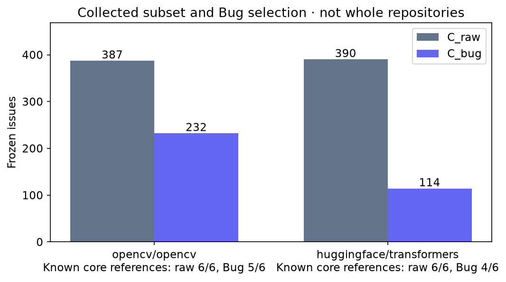
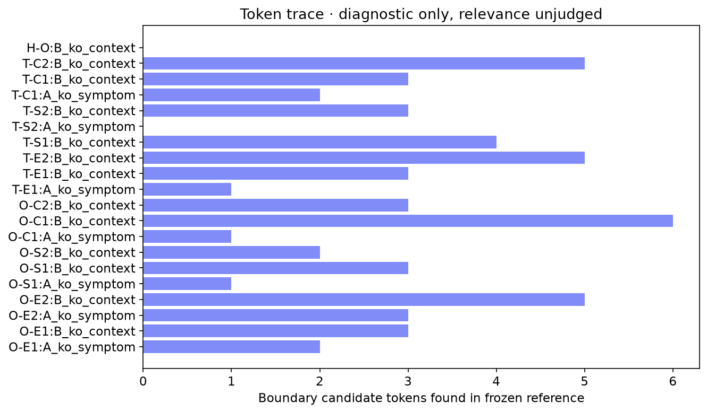
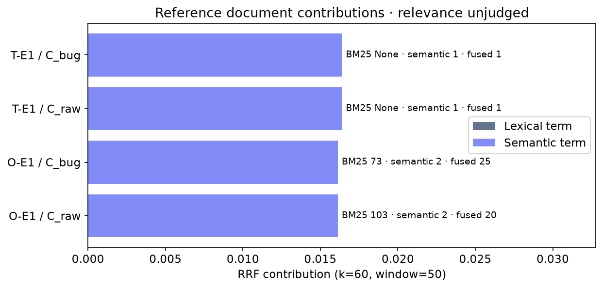

# 사람 검토·후속 실험 v2 — batch_001

현재 상태: **AWAITING_HUMAN_REVIEW**. 실제 검토자 0명, 판정 0/429쌍, 공통 비교 가능 질의 0/36개. 분모가 0인 품질 지표는 null이며 0%가 아닙니다.

| 단계 | 실제 상태 |
|---|---|
| preservation | VERIFIED |
| scoring | IMPLEMENTED_TESTED |
| review_html | READY |
| human_review | AWAITING_HUMAN_REVIEW |
| mechanical_audit | COMPLETE |
| reproduction | REPRODUCED |
| K1 | DEFERRED_NO_VALIDATED_FAILURE |
| R1 | DEFERRED_NO_VALIDATED_FAILURE |
| E1 | AWAITING_EQUIVALENCE_REVIEW |
| E2 | BLOCKED_CONDITION_EVIDENCE |
| E3 | NO_CERTIFIED_CONTROL |
| manual_study | PENDING_MANUAL_STUDY |
| summary | NOT_APPLICABLE_YET |

## 실행 결과와 근거

부모 [run_001](../../scenario_pilot_v1/run_001/report.md)의 813개 파일을 바이트 SHA-256으로 보존했습니다. 검색 버전과 새 채점·보고 버전은 [lineage.json](lineage.json)에 따로 기록했습니다. 기존 핵심 순위 216조건은 재추론하지 않고 읽었습니다. 재현 검사 12조건: **REPRODUCED**. [실제 비교](reproduction.json), [예산·인코딩 횟수](budget.json).

검색 방식별 공식 Hit@5와 pooled nDCG@5는 질의 승인과 모든 공통 풀 판정이 완료된 동일 질의만 집계합니다. Top-5 밖의 미판정 문서도 분모에 필요합니다. confirmed_hit는 확정 평균과 분리합니다. unavailable·댓글 전용·검토자 불일치는 미확정이며 0점이 아닙니다. 1점만으로 nDCG가 높을 수 있어 Hit@5와 같이 읽어야 합니다.

질의 승인 0/36 · 공통 풀 완료 0/36 · 실제 비교 0/36. [질의별 수치·미판정 사유](metrics_by_query.csv), [같은 분모 집계](metrics_summary.csv), [검토 진행](review_progress.csv).

[전체 사례와 실제 질의·Top-5](casebook.md) · [사례별 소형 순위](rankings/) · [근거 카탈로그](evidence_catalog.jsonl). 12개 개발 가족과 번역/변형·역사 사례를 독립 표본으로 합치지 않습니다. 사람 판정 없이 성공·악화·무차이를 만들지 않았습니다. [짝 비교](paired_changes.csv)는 실제 검증 가능한 비교가 없으면 빈 표입니다.

기계적 관찰: [범위](scope-audit.csv), [한국어 기술 토큰](token-audit.csv), [RRF 기여분](rrf-contributions.csv), [최대 유사도 구간](chunk-audit.csv), [문서별 추적](failure_trace.csv). 이는 관련성 판정이나 실패 원인 확정이 아닙니다. 범위 밖/필터 밖의 참고 원문과, 유용한 다른 문서가 검색되지 않는 실패는 구분합니다. 최대 구간의 짧은 예시는 문서별 하나이며 다른 구간에는 same_example_chunk=false를 표시합니다.

## 실제 자료에서 생성한 그림






그림별 원자료·사용 행·해시·생성 명령은 [figure_data/generation.json](figure_data/generation.json)에 있습니다. 품질 그림 상태: **NOT_GENERATED_PENDING_REVIEW**. 신규 후보에 대한 짝 지연·행동 검사 그림은 실행과 검토가 있을 때만 생성합니다. 기존 지연과 새 측정의 차이를 후보 개선으로 주장하지 않습니다.

## 사람이 작성할 검토와 재개

로컬 `data/scenario_followup_v2/batch_001/review/review.html`을 Chrome에서 여세요. 실제 Chrome CSV 38행·429행 다운로드와 CLI 재입력을 확인했습니다. Codex 안쪽 브라우저에서는 다운로드가 실제 파일로 저장되지 않는 경우가 있어 Chrome을 권장합니다. 질문 검토와 관련성 검토를 각각 CSV로 내려받아 실제 경로를 지정합니다. 미작성 행은 그대로 두어도 됩니다. 브라우저 임시 저장은 백업을 대신하지 않으므로 CSV를 저장하세요. 질문 원문과 근거를 먼저 확인하고 순위가 보이는 사례집을 읽었다면 exposure에 표시하세요. 공개 [빈 양식](review_queue/)은 완료 판정이 아닙니다.

```powershell
.venv/Scripts/python.exe -m evaluation.scenario_followup resume --batch data/scenario_followup_v2/batch_001 --query-reviews "$env:USERPROFILE/Downloads/query_reviews.completed.csv" --reviews "$env:USERPROFILE/Downloads/human_reviews.completed.csv"
.venv/Scripts/python.exe -m evaluation.scenario_followup report --batch data/scenario_followup_v2/batch_001
.venv/Scripts/python.exe -m evaluation.scenario_followup verify-publication --batch data/scenario_followup_v2/batch_001
```

검토자가 둘 이상이면 각자의 행을 review_item_id+reviewer_id로 유지합니다. 불일치는 실제 사람의 adjudications CSV로 조정합니다. 프로그램은 신원을 인증하지 않습니다. 원본 검토 파일 사본은 내용 해시별 inputs/에 보존하고 새 round에 채점합니다. 풀에 새 후보가 생기면 baseline까지 같은 확장 풀로 재채점해야 합니다.

K1/R1 및 E1/E2/E3는 [실행 도구·승인 입력 계약](../../../../evaluation/scenario_followup_v2/README.md)이 검증하는 사람 근거가 있을 때만 실행합니다. 현재 게이트 미충족 단계를 완료로 보고하지 않습니다. 운영 검색·필터·모델을 바꾸지 않았습니다.

## 검증·게시와 한계

[테스트 로그](tests/)에는 기존 미커밋 변경을 포함한 baseline과 게시 소스 트리 검사를 구분합니다. 신규 구현은 부분 검토 수식, ID/해시, 판정 불일치, 풀 확장, HTML 안전성, 게이트를 테스트합니다. 합성 fixture는 실제 검색 정답에 포함하지 않습니다. 재개 명령은 미작성 CSV로 실제 실행해 검토 대기 상태를 확인했습니다.

공개 자료로 순위·수치·보고를 감사할 수 있습니다. 정확한 임베딩 재실행에는 gitignored 동결 스냅샷과 고정 모델 캐시가 필요합니다. 전체 저장소나 일반 관련성을 대표하지 않는 12개 재구성 개발 사례입니다. 원문 작성 시 원인·해결책을 읽은 노출 가능성과 실제 검토 노출을 기록합니다. 구 run·질의·사람 원본은 덮어쓰지 않았습니다. 사용자 요청에 따라 main에만 게시하며 강제 push/자동 병합은 하지 않습니다.
