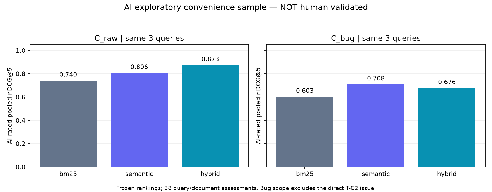

# AI 직접 검토 예비 비교 — machine_001

사용자의 “직접 쭉 진행” 요청에 따라 어시스턴트가 동결 원문을 읽고 **3개 사례·38개 질의/문서 쌍**을 직접 판정했습니다. 사람 판정·신원·시간·승인을 만들지 않았으며 기존 사람 qrels와 공식 지표는 변경하지 않았습니다. **이 표는 AI 판정에 의존하는 탐색적 결과입니다.**

| 범위 | 방법 | 공통 N | AI Hit@5 | AI MRR@5 | AI pooled nDCG@5 | 직접 문서 범위 밖 |
|---|---|---:|---:|---:|---:|---:|
| C_raw | bm25 | 3 | 1.000 | 1.000 | 0.740 | 0 |
| C_raw | semantic | 3 | 1.000 | 1.000 | 0.806 | 0 |
| C_raw | hybrid | 3 | 1.000 | 1.000 | 0.873 | 0 |
| C_bug | bm25 | 3 | 0.667 | 0.667 | 0.603 | 1 |
| C_bug | semantic | 3 | 0.667 | 0.667 | 0.708 | 1 |
| C_bug | hybrid | 3 | 0.667 | 0.667 | 0.676 | 1 |

## 확인한 결과

- OpenCV MinGW `posix_memalign` 빌드 오류: 오류와 환경이 있는 B 질의에서는 원문 #29350이 세 방식 모두 1위입니다. AI 판정상 부분 관련 빌드 문제를 무관한 런타임 ASan 문제로 대체하는 Hybrid 결과도 있어 OpenCV의 pooled nDCG는 BM25보다 낮았습니다.
- Gemma4 영상 `tuple.to` 오류: #47879가 세 방식 모두 1위입니다. 같은 Gemma 이름이나 AttributeError라도 LoRA 분류기·Gemma1 GELU·KV cache 문제는 해당 영상 오류의 근거가 아닙니다. 본문의 수정 제안은 이 작업에서 실행 검증한 해결책이 아닙니다.
- Trainer 체크포인트 이동 후 종료 오류: #48315가 C_raw에서는 세 방식 모두 1위입니다. 동결 Bug 필터에는 이 문서가 없어 C_bug에서는 어떤 검색 알고리즘도 반환할 수 없습니다. 이 범위 누락과 순위 알고리즘 실패는 구분합니다.
- 직접 관련 문서의 Top-5 포함은 C_raw에서 3/3, C_bug에서 2/3입니다. C_bug의 직접 관련 문서가 실제 범위에 있는 2개 질의만 조건부로 보면 세 방식 모두 2/2입니다. 위 공식 분모는 범위와 방법 모두 동일한 3개 질의를 유지합니다.

성공·악화·무차이는 [실제 사례집](casebook.md), [Top-5 원자료](top5.csv), [방법별 결과](results.csv), [BM25와 Hybrid의 짝 비교](paired_comparison.csv)에 모두 남겼습니다. 이 비교는 기존 순위 간 비교이며 새 검색 설정을 실행한 before/after 실험이 아닙니다.

## 판정과 해석 조건

2점은 일치하는 증상·조건에 직접 유용한 근거, 1점은 관련 하위 기능이나 다른 오류/단계/조건으로 직접 원인 근거 부족, 0점은 넓은 단어·라이브러리·모델 이름만 겹치는 다른 기능입니다. [AI 판정 원본](machine_annotations.jsonl)의 모든 인용은 동결 제목/본문에 실제로 있고 문서·질의 해시와 URL을 코드로 검사했습니다. 인용의 존재 확인은 AI 관련성 판단 자체가 옳음을 보장하지 않습니다.

이 3개는 이미 참고 원문에서 재구성된 개발 사례를 편의 선택한 것입니다. B 질의만 검토했고 사람이 만든 독립 테스트셋이나 중복 정답 쌍이 아닙니다. 소스와 일부 순위를 이미 본 노출이 있어 블라인드 평가가 아닙니다. 3개 표본의 100%를 전체 검색 정확도로 해석하면 안 됩니다. 다른 9개 가족·A/C 질의·새 후보·일반 문제는 이 AI 품질 집계에 포함하지 않았습니다. 긴 문서는 제목과 관련 본문 구간을 읽었으며 링크 문서·댓글·상류 버그의 실제 재현까지 검증한 것은 아닙니다.

Bug 라벨·한국어 토큰·RRF를 동시에 또는 임의로 바꾸지 않았습니다. K1/R1/E1/E2/E3의 기존 사람 근거 게이트도 열지 않았습니다. 새 조회·모델 추론·학습·유료 API는 추가하지 않고 기존 18개 순위 조건만 재사용했습니다. 알려진 범위 누락을 개선이라고 꾸미거나 AI 판정을 공식 확정 지표로 옮기지 않습니다.

## 그림·재현·게시 코드 검증



그림의 수치는 [summary.csv](summary.csv)의 실제 값입니다. [manifest.json](manifest.json)에 원자료·그림·판정·검색 파일 해시와 생성 명령을 기록했습니다. 원문 전체·모델 캐시는 게시하지 않았습니다. [게시 코드 테스트](tests/published-tree.txt)와 [코드 바이트 증거](tests/published-tree.json)를 함께 제공합니다.

```powershell
.venv/Scripts/python.exe -m evaluation.machine_pilot --run data/scenario_followup_v2/machine_001
```

공개 수치 재집계는 `machine_annotations.jsonl`, `top5.csv`, `results.csv`, `summary.csv`로 가능합니다. 로컬 명령은 원래 동결 스냅샷과 `data/scenario_followup_v2/batch_001` 보존 자료가 필요합니다. 위 명령은 판정을 생성하지 않고 이미 기록한 AI 판정을 검증·재집계합니다. 사용자가 수행해야 하는 전체 검토는 추가하지 않았습니다.
