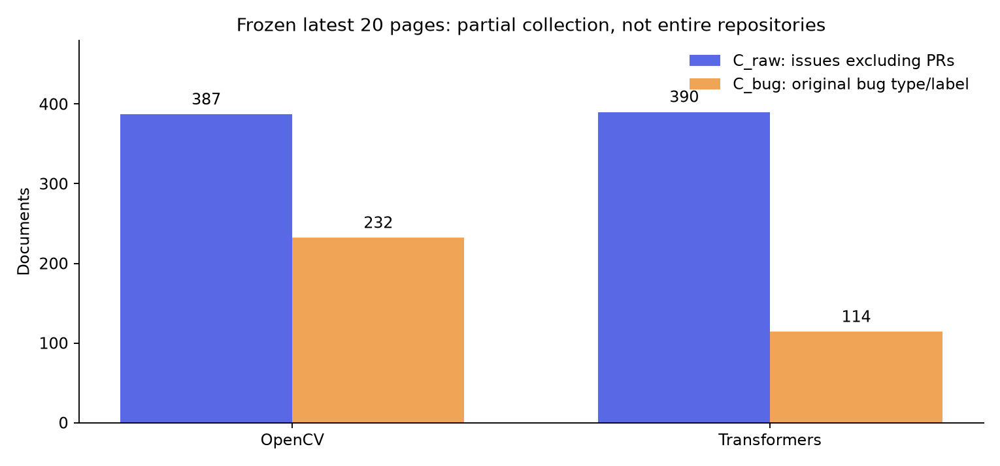
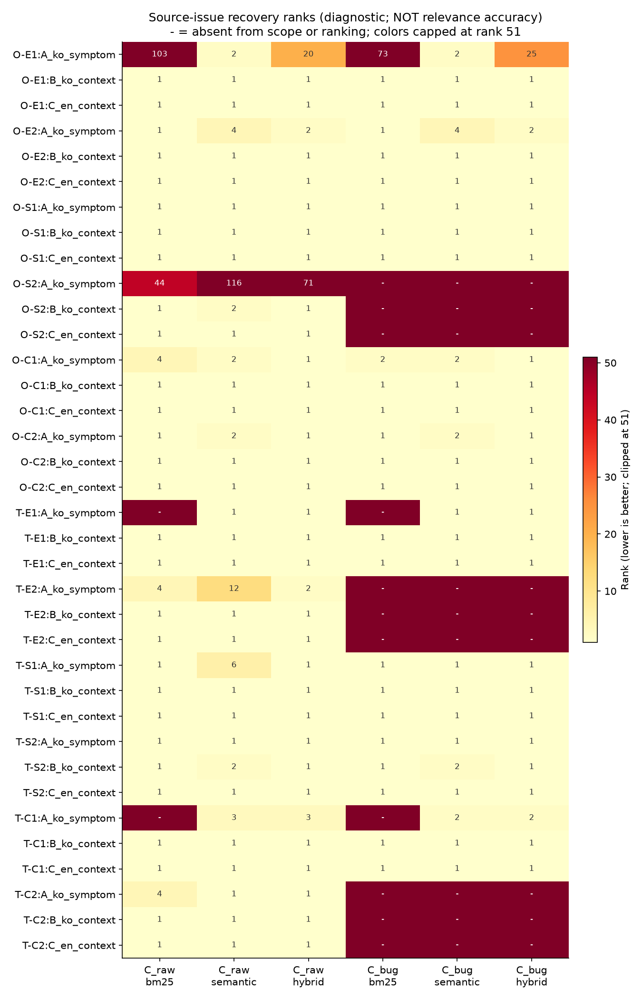
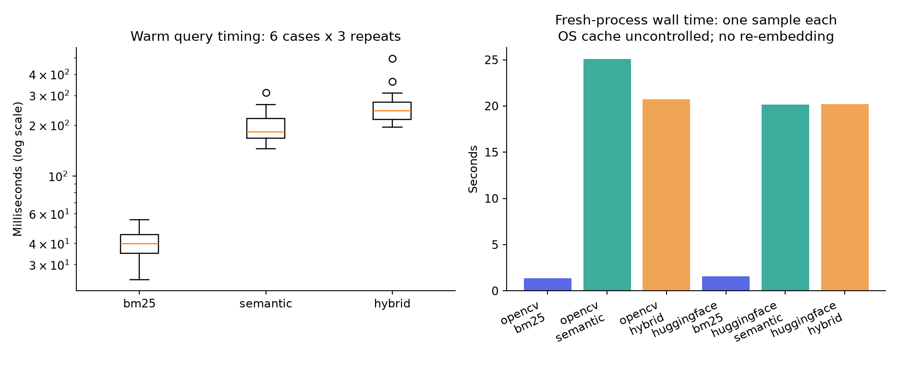

# GitHub Issue 검색 상황 질의 파일럿 — 2026-10-01

현재 상태: **AWAITING_HUMAN_REVIEW**. 실제 수집·고정 모델 검색·검토 자료 생성은 수행했습니다. 사람이 질의와 문서 관련성을 판정하지 않았으므로 검색 품질 평가는 완료되지 않았습니다.

이 실행은 기존 Issue에서 신고자의 증상을 재구성한 **개발 표본 12개**입니다. 실제 신규 사용자 문제, 중복 판별, 현재 버그 재현 또는 해결 가능성을 검증한 결과로 일반화할 수 없습니다.

## 수행 범위

| 항목 | 실제 실행 |
|---|---|
| 기준 코드 | `cf9e3e24e0b432fb9f98e30d92d46d5c2b604369` + manifest에 기록된 소스 파일 해시 |
| 알고리즘 | 기존 양의 IDF BM25, multilingual-e5-small, 같은 가중치 RRF(60, 상위 50개) |
| 모델 | `intfloat/multilingual-e5-small` / revision `614241f622f53c4eeff9890bdc4f31cfecc418b3` |
| 길이 처리 | 448토큰, 64토큰 중첩, 가장 높은 구간 간 코사인 유사도 |
| GitHub API 호출 | 44 / 100; 재시도·토큰 교체 없음 |
| 핵심 검색 | 216 / 216 (12사례 × 3입력 × 3방법 × 2범위) |
| 역사 사례 점검 | 12 / 12; 핵심 평균에서 제외 |
| 시간 측정 | warm 54 / 54, cold 6 / 6 |
| D_error_only | 선택 실험 미실행 |
| 실행 오류 | 0 / 228 검색; BM25 정상 무일치 5회 |
| 총 검색·시간 표본 | 288회 = 핵심 216 + 역사 12 + warm 54 + cold 6 |
| 계산 시간 | 1495.4초 / 5,400초; 모델/표본/인덱스/검색/cold 포함, 문서 작성·테스트 제외 |
| 사람 검토 | 0명; 429개의 질의-문서 쌍, 핵심 36질의 미판정 |
| Hit@5 / pooled nDCG@5 | **null — 미판정**; 0으로 대체하지 않음 |
| 웹 비교 / 요약 | PENDING_MANUAL_STUDY / NOT_APPLICABLE_YET(요약 미구현) |

## 데이터 범위와 필터

| 저장소 | API 항목(PR 포함) | C_raw | C_bug | PR 제외 | 생성 시각 범위(UTC) | 부분 수집 |
|---|---:|---:|---:|---:|---|---|
| opencv/opencv | 2000 | 387 | 232 | 1613 | 2025-11-16T15:11:28Z — 2026-09-30T09:31:24Z | True |
| huggingface/transformers | 2000 | 390 | 114 | 1610 | 2026-07-08T08:59:48Z — 2026-09-30T22:13:51Z | True |

두 범위 모두 같은 스냅샷이며 레이블·본문을 바꾸지 않았습니다. Bug는 기본 레이블 `bug` 또는 type.name=Bug의 대소문자 무시 일치입니다. C_raw는 평가 대조용이며 서비스의 Bug 필터를 전체 Issue로 바꾸지 않았습니다.

| 사례 | 원문 | 분류(검토 전) | Bug 범위에 원문 존재 |
|---|---|---|---|
| O-E1 | [#29350](https://github.com/opencv/opencv/issues/29350) | error_literal | True |
| O-E2 | [#28525](https://github.com/opencv/opencv/issues/28525) | error_literal | True |
| O-S1 | [#29565](https://github.com/opencv/opencv/issues/29565) | symptom_without_error | True |
| O-S2 | [#30090](https://github.com/opencv/opencv/issues/30090) | symptom_without_error | False |
| O-C1 | [#28207](https://github.com/opencv/opencv/issues/28207) | condition_sensitive | True |
| O-C2 | [#29636](https://github.com/opencv/opencv/issues/29636) | condition_sensitive | True |
| T-E1 | [#47879](https://github.com/huggingface/transformers/issues/47879) | error_literal | True |
| T-E2 | [#48346](https://github.com/huggingface/transformers/issues/48346) | error_literal | False |
| T-S1 | [#47752](https://github.com/huggingface/transformers/issues/47752) | symptom_without_error | True |
| T-S2 | [#48826](https://github.com/huggingface/transformers/issues/48826) | symptom_without_error | True |
| T-C1 | [#48501](https://github.com/huggingface/transformers/issues/48501) | condition_sensitive | True |
| T-C2 | [#48315](https://github.com/huggingface/transformers/issues/48315) | condition_sensitive | False |

개발 표본의 참고 원문은 C_raw에 12/12, C_bug에 9/12개 있습니다. 이 수는 표본 내 필터 관찰이며 전체 저장소의 정답 수집률이 아닙니다. Bug 필터에서 빠진 사례도 216개 핵심 실행과 검토 과제에 남겼습니다.

역사 사례 OpenCV #17687과 Transformers #24694는 각각 두 범위에서 원문 존재 여부를 별도로 확인했습니다:

- [opencv/opencv#17687](https://github.com/opencv/opencv/issues/17687): C_raw=False, C_bug=False. 개별 조회한 원문을 검색 인덱스에 주입하지 않았습니다.
- [huggingface/transformers#24694](https://github.com/huggingface/transformers/issues/24694): C_raw=False, C_bug=False. 개별 조회한 원문을 검색 인덱스에 주입하지 않았습니다.

## 순위 관찰 — 정확도 아님

아래 수치는 질의 작성에 사용한 원문 Issue가 상위 5개에 돌아오는지를 보여줍니다. 다른 결과가 더 직접 관련될 수 있으므로 Hit@5, Recall@5, 해결 성공률로 해석하지 않습니다. 작성자는 원문을 읽었고 결과 순위·댓글·제안된 수정은 질의 작성에 사용하지 않았습니다.

| 범위 | 방법 | A 한국어 증상 | B 한국어 조건 추가 | C 영어 동일 정보 |
|---|---|---:|---:|---:|
| C_raw | bm25 | 8/12 | 12/12 | 12/12 |
| C_raw | semantic | 9/12 | 12/12 | 12/12 |
| C_raw | hybrid | 10/12 | 12/12 | 12/12 |
| C_bug | bm25 | 6/12 | 9/12 | 9/12 |
| C_bug | semantic | 9/12 | 9/12 | 9/12 |
| C_bug | hybrid | 8/12 | 9/12 | 9/12 |

전체 질의 문자열·원문 링크·상위 5개 제목/상태/레이블/링크/방식별 점수는 [사례별 결과](casebook.md)에 있습니다. Top-20 및 실행 상태·해시는 [rankings.jsonl](rankings.jsonl)에 기록했습니다. 모든 관련성 등급은 `UNJUDGED`입니다.

## 시간·자원 관찰

| 방법 | Warm 표본 수 | 중앙값(ms) | 최소—최대(ms) |
|---|---:|---:|---:|
| bm25 | 18 | 39.70 | 24.37—55.29 |
| semantic | 18 | 182.68 | 144.79—311.75 |
| hybrid | 18 | 242.49 | 194.48—494.24 |

Warm은 공유 모델/문서 인덱스가 준비된 프로세스에서 새 질의 인코딩까지 측정했습니다. 메모리 벡터 적재 상태의 영향을 포함하며 서비스 전체 응답 시간이나 운영 P95가 아닙니다. Cold는 별도 프로세스 시작부터 모델/인덱스 적재·검색·종료까지의 1회 관찰이며 OS 파일 캐시는 통제하지 않았습니다.

20개 문서 표본의 인덱싱 추정은 2821.8초, 전체 777개 문서 / 3242개 구간입니다. 표본 RSS 관찰 최고치는 1251.7 MiB입니다. 이것은 표본 시점 RSS이며 전체 실행 최고 메모리로 보고하지 않습니다. 기존의 같은 본문·resolved revision·분할 설정 벡터 **266문서/1,268구간을 읽기 재사용**했습니다. 원본 캐시는 수정하지 않았고 복사 검증/파일 해시는 [cache-reuse.json](cache-reuse.json)에 있습니다. 실제 인덱싱 시간은 캐시 재사용을 포함합니다.

## 계획과 차이·아직 하지 않은 작업

- 후보 상한 48보다 1개 많은 **49개**를 원문/메타데이터로 검토했습니다. 첫 48개에 기능 요청·통합 triage 등이 많아 같은 수집 범위에서 고정 시드 순서의 다음 후보 1개를 추가했습니다. API 범위 확대와 순위에 따른 사례 교체는 없었습니다. [선택 감사 기록](../../../../evaluation/scenario_pilot_v1/selection-audit.json)을 공개합니다.
- 유형별 두 사례씩 구성했지만 작성자의 잠정 분류입니다. 특히 T-E2의 override 부재와 T-S1의 설정 전달은 조건형과 겹칠 수 있어 사람 검토에서 우선 확인해야 합니다. 독립 원인/중복 관계 전체를 검증하지 않았습니다.
- 질의는 Issue의 증상을 재구성했습니다. 한국어 표현의 충실성, B↔C 정보 동등성, 원인·해결 누출 여부는 사람이 아직 확인하지 않았습니다. 첨부 이미지는 실행·열람하지 않았으며 이미지 없이는 이해할 수 있는지의 전체 corpus 판단도 미완료입니다.
- E1 표현/무관 정보, E2 조건 대조, E3 인증 무정답 실험은 사람 검토 조건이 충족되지 않아 실행하지 않았습니다. 준비 상태와 재개 조건은 [diagnostics.json](diagnostics.json) 및 README에 기록했습니다. E4 구간 위치·길이는 계산했고 증상/환경/템플릿 분류는 미판정입니다.
- 운영 데이터·서비스 모델 캐시는 덮어쓰지 않았습니다. 원문·벡터·전체 본문을 포함한 blind HTML은 로컬 gitignored 폴더에 보존합니다. GitHub 공개 파일로 원문 작성자 객체·토큰·전체 본문·개인 경로는 내보내지 않았습니다.
- 첨부 문서의 push 금지는 사용자의 이번 “push해줘” 요청으로 대체했습니다. 평가 코드와 소형 보고서만 게시하며 기존 미커밋 코드 리뷰/UI 변경은 포함하지 않습니다.

## 지금 내릴 수 있는 결정

1. Bug 필터에서 참고 원문 3개가 빠지고 역사 원문 2개도 이번 최신 수집 범위 밖입니다. 먼저 **수집 범위/레이블 안내**를 확인해야 합니다. 모든 검색 실패를 모델 문제로 볼 수 없습니다.
2. 방법·언어별 원문 회수 순위가 달라도 일반 관련성 개선의 근거가 되지는 않습니다. **36질의와 풀링 문서 사람 검토를 먼저 완료**하고, 같은 원인 가족을 최종 평가로 재사용하지 않습니다.
3. **O-E1 한국어 증상 질의**에서 원문은 의미 검색 2위지만 Hybrid는 C_raw 20위 / C_bug 25위였습니다. 결합이 원문 순위를 낮추는 반례입니다. 원문이 직접 관련인지와 상위 경쟁 문서를 먼저 사람이 판정하고, E4 구간도 함께 검토한 뒤 결합/입력 처리 변경을 결정합니다. 이번에는 가중치를 튜닝하지 않았습니다.

## 확인·재현

실행 명령과 사람 검토 칸의 의미는 [파일럿 README](../../../../evaluation/scenario_pilot_v1/README.md)에 있습니다. 원문 snapshot은 기본 Git 제외이므로 정확히 같은 데이터의 재실행은 이 컴퓨터의 원래 run 폴더가 필요합니다. GitHub의 해시·질의·범위 ID·순위·CSV로 이번 결과를 감사할 수 있으며, 새 수집은 시점에 따라 달라집니다.

기존 로컬 테스트: [baseline-tests.txt](baseline-tests.txt), 추가 계약을 포함한 로컬 전체 **47 passed**: [pilot-tests.txt](pilot-tests.txt). 기존 미커밋 코드 리뷰/UI 변경을 제외한 **게시 대상 복사본 41 passed**: [published-tests.txt](published-tests.txt). 두 상태 모두 기존 Starlette/httpx 경고 1개가 있었습니다. 테스트 통과는 검색 관련성/버그 해결을 증명하지 않습니다.

사람 검토 후 `score`는 provenance/해시를 검사하고 실제 판정만 계산합니다. 프로그램은 사람의 신원을 인증하지 못하므로 형식 검증을 실제 신원 확인으로 과장하지 않습니다.

추가 감사 자료: [실패 위치·경쟁 설명](observations.md), [데이터 품질 집계](data-quality.json), [범위별 문서 ID](scope-documents.csv), [실제 인덱싱 시간](indexing.json).
